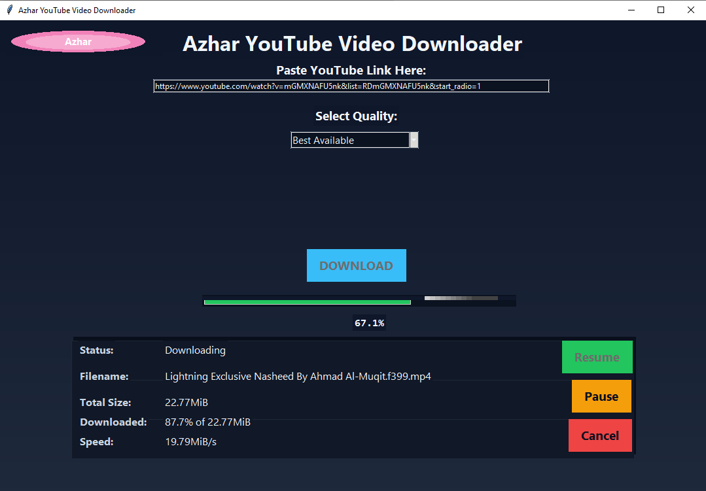
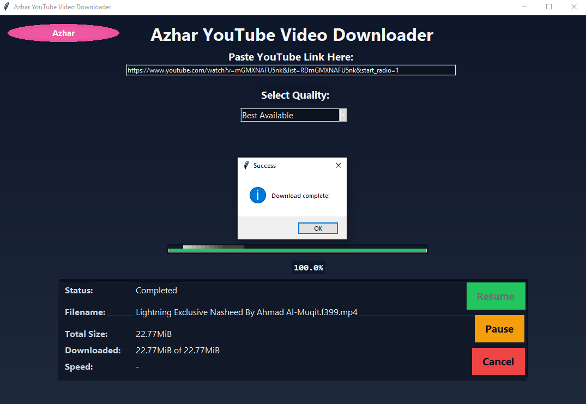

# Azhar YouTube Video Downloader

A polished Tkinter desktop app for Windows to download YouTube videos or audio with live progress, pause/resume, and clean UI. Powered by yt-dlp and FFmpeg under the hood.

## Features

- Paste any YouTube link (watch, shorts, youtu.be) – auto-normalized to watch URL.
- Quality presets:
  - Best Available, 4K, 2K, 1080p, 720p, 480p, 360p, 144p
  - Audio Only (M4A)
- Live progress: percent, total size, downloaded, and speed.
- Pause, Resume (keeps partial .part), and Cancel.
- Friendly error messages for missing yt-dlp/FFmpeg and common merge issues.
- Downloads saved to “Azhar Youtube Video Downloader” folder next to the app.
- Clean, gradient UI with ttk styling.

## Screenshots

 

## How it works

- The app shells out to `yt-dlp` for downloads and uses FFmpeg for muxing video+audio where needed.
- The console output is parsed in real-time to update the UI without blocking.
- For “Audio Only”, it selects `bestaudio[ext=m4a]` and skips merge.

## Requirements

- Windows 10/11.
- yt-dlp and FFmpeg available to the app (bundled or side-by-side).
- Python 3.9+ only for development; end-users don’t need Python if you ship the EXE.

## Quick Start (dev)

1. Clone the repo:
git clone https://github.com/mdazharulislamnk/Azhar-YouTube-Video-Downloader.git
cd Azhar-YouTube-Video-Downloader

2. Install dependencies you need during development:
pip install yt-dlp


FFmpeg: download ffmpeg.exe and place it next to the script or add to PATH.

3. Run:
python YTDByAzharV4Complete.py


## Build a single-file EXE (Windows)

Two ways: simple side-by-side binaries (easiest) or fully bundled.

### A) Simple (ship yt-dlp.exe and ffmpeg.exe next to the EXE)

1. Install PyInstaller:
pip install --upgrade pyinstaller


2. Optional app icon:
- Convert PNG to ICO (use Pillow):
  ```
  pip install pillow
  python - << "PY"
from PIL import Image
Image.open("logo.png").convert("RGBA").save("azhar.ico", sizes=[(256,256),(128,128),(64,64),(48,48),(32,32),(16,16)])
print("Saved azhar.ico")
PY
  ```
3. Build:
pyinstaller --onefile --noconsole --name "AzharYTD" --icon "azhar.ico" YTDByAzharV4Complete.py


4. Copy runtime tools next to the EXE:
copy /y yt-dlp.exe dist
copy /y ffmpeg.exe dist\


5. Distribute `dist\AzharYTD.exe` together with `yt-dlp.exe` and `ffmpeg.exe`.

### B) Fully bundled (embed yt-dlp and FFmpeg inside the EXE)

1. Place `yt-dlp.exe` and `ffmpeg.exe` in the project root.
2. Build:
pyinstaller --onefile --noconsole --name "AzharYTD" --icon "azhar.ico" ^
--add-binary "yt-dlp.exe;." --add-binary "ffmpeg.exe;." ^
YTDByAzharV4Complete.py


3. Distribute just `dist\AzharYTD.exe`.

Note:
- If you embed binaries, adapt the code to resolve frozen paths via `sys._MEIPASS` or place both binaries in the same extraction dir (yt-dlp usually finds FFmpeg there automatically).

## Folder Layout

.
├─ YTDByAzharV4Complete.py
├─ logo.png / azhar.ico
├─ yt-dlp.exe # optional (ship or embed)
├─ ffmpeg.exe # optional (ship or embed)


## Usage

- Paste a YouTube URL.
- Choose quality (e.g., 1080p or Audio Only).
- Click DOWNLOAD.
- Use Pause/Resume as needed. Cancel deletes partial file.
- On success, the file appears in:
Azhar Youtube Video Downloader<Video Title> [Quality].mp4


## Troubleshooting

- “FFmpeg not found”:
- Place `ffmpeg.exe` next to the app or bundle it.
- Shows audio stats at the end for mixed downloads:
- Handled in parsing by prioritizing video lines and restoring last video totals during merge.
- SmartScreen warning:
- Notarize/sign the EXE for public distribution or choose “Run anyway”.

## Roadmap

- File picker for custom output directory
- Batch downloads and playlist support
- Theme toggle (Light/Dark)
- Auto update for yt-dlp

## License

MIT. See `LICENSE`.

## Credits

- yt-dlp (MIT)
- FFmpeg (LGPL/GPL components)
- Tkinter/ttk